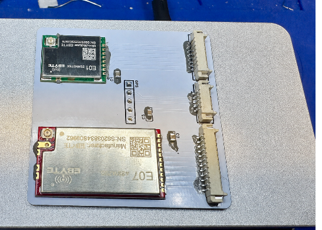

# Signal Crypt

### Independent E01/E07/GPS Carrier

Signal Crypt v1.1 is a compact carrier PCB for mounting and connecting compatible Ebyte E01, Ebyte E07, and GPS modules.

Although designed with CYD-based wireless builds in mind, it is a general-purpose pass-through carrier that may be used in any project with matching module dimensions, voltage requirements, connections, and pin assignments.

---

  

  

---

## Changelog

### v1.0
Initial release. Tested and confirmed working.

### v1.1
Updated the GPS connector to a 4-pin configuration to match the CYD 4-pin connection. Only four pins were used in the original design, so the connector was revised accordingly.

---

## About

Signal Crypt was originally created to replace loose wiring with a cleaner, more reliable installation that would fit an existing enclosure.

It is primarily a passive carrier and pass-through interconnect designed to provide a more organized way to connect supported E01, E07, and GPS modules.

The project was also created to support the hardware-building community by making compatible hardware available for others to manufacture, adapt, improve, and share.

**Build Together. Share Forward.**

---

## How It Works

Signal Crypt is primarily a pass-through interconnect.

Signals are routed directly between the supported module footprints and cable connectors. For example:

- Pin 1 connects to Pin 1
- Pin 2 connects to Pin 2
- Remaining signals follow the same one-to-one routing principle

The board does not contain:

- A microcontroller
- Firmware
- Software

It provides:

- Secure mounting for supported modules
- Organized one-to-one signal routing
- Consistent cable connections
- Optional power-decoupling components
- A compact layout suitable for enclosed CYD builds
- Easier assembly and troubleshooting than loose wiring

---

## Compatibility

Signal Crypt is a passive hardware carrier intended for CYD-based builds using compatible E01, E07, and GPS module connections.

---

## Files

This repository contains the Signal Crypt manufacturing files.

The original release contains Gerber manufacturing files.

Users should independently inspect the manufacturing files and verify all dimensions, connections, footprints, clearances, electrical compatibility, and fabrication settings before ordering or assembling the PCB.

---

## Intended Use

Signal Crypt is intended for electronics development, interoperability testing, and lawful experimentation.

Users are responsible for verifying electrical compatibility and complying with applicable radio-frequency regulations and local laws.

The design and manufacturing files are provided as-is, without warranty.

---

## Original Project

This GitHub repository is an unmodified copy of the Signal Crypt project.

All credit for the original PCB design and Gerber manufacturing files belongs to the original Signal Crypt creator.

### Source

https://www.pcbway.com/project/shareproject/Signal_Crypt_9edc6af9.html

---

Please refer to the original project and applicable license terms for complete licensing information.

---

Signal Crypt€” Independent E01/E07/GPS Pass-Through Carrier

